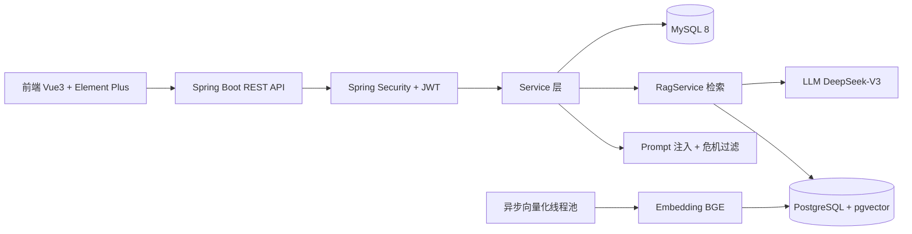

# 心灵守护者 - 心理健康助手

基于 **Spring Boot 3 + Spring AI + PgVector** 的前后端分离 AI 心理健康咨询系统，支持 RAG 检索增强的流式对话、情绪日记、知识库管理、数据分析等功能。


> 一个前后端分离的 AI 心理咨询系统：SSE 流式对话 + RAG 语义检索增强 + 内容安全双防护。

## ✨ 核心亮点

- **RAG 检索系统 6 版技术演进**：零检索 → 自研 TF-IDF → Embedding 稠密向量 → PgVector + HNSW → 异步向量化 → 事务 + 批量 Embedding，完整踩坑与权衡记录（见下文）
- **双库一致性**：MySQL（业务数据）+ PostgreSQL/pgvector（向量）双数据源，影子表原子切换，向量索引重建零空窗
- **异步向量化**：`@Async` 独立线程池 + 批量 Embedding，发布文章 **10s → 200ms**，Embedding 调用次数 **降低 90%**
- **安全加固**：越权注册修复、JWT 标准 Bearer、Prompt 注入拦截 + 危机识别双防护
- **操作审计日志**：`@AuditLog` 注解 + AOP 切面异步落库（操作人/目标/入参快照/结果/耗时/IP），按月 RANGE 分区 + 定时 `DROP PARTITION` 维护，保留期可配置（默认 12 个月）
- **性能优化**：用户活跃度统计 SQL **90 → 3 次**、多级缓存、原子计数
- **34 个单元测试** 全绿，Docker Compose 四容器一键部署

## 🏗 系统架构



---

## 技术栈

### 后端
- **框架**：Spring Boot 3.5、Spring Security、Spring AI 1.0、Spring Cache
- **ORM**：MyBatis-Plus 3.5
- **数据库**：MySQL 8（业务数据）、PostgreSQL 16 + pgvector（向量检索）
- **中间件**：Caffeine 本地缓存、HikariCP 连接池
- **认证**：JWT + 过滤器鉴权 + 方法级 `@PreAuthorize`
- **AI 服务**：兼容 OpenAI 接口（SiliconFlow / DeepSeek 等）
  - Embedding 模型：BAAI/bge-large-zh-v1.5（1024 维中文向量）
  - 对话模型：deepseek-ai/DeepSeek-V3

### 前端
- **框架**：Vue 3 + Vite 6
- **UI 库**：Element Plus
- **HTTP**：Axios（带 JWT 自动注入 + 401 自动跳登录）
- **可视化**：ECharts（情绪趋势折线图）
- **富文本**：WangEditor（知识库文章编辑）

### 工程化
- **部署**：Docker Compose 一键启动（MySQL + PgVector + Backend + Frontend）
- **文档**：Knife4j / Swagger 3（`/doc.html`）
- **监控**：Spring Boot Actuator（`/actuator/*`）
- **接口统计**：自定义 SQL 计数拦截器（防止 N+1）

---

## 项目结构

```
ai_assistant2_0/
├── backend/ai-spingboot/                        # Spring Boot 后端
│   ├── src/main/java/org/example/aispingboot
│   │   ├── AiService/                            # AI 对话 & RAG 检索核心
│   │   │   ├── rag/                               #   RagService + RagAsyncTask
│   │   │   └── safety/                            #   Prompt注入拦截 + 危机安全过滤
│   │   ├── common/                                # 全局异常 / Result 封装 / 错误码
│   │   ├── config/                                # Security / JWT / Cache / Async / 多数据源
│   │   ├── controller/                            # 8 个 REST Controller
│   │   ├── service/                               # Service 层 + DTO 转换
│   │   ├── entity/ mapper/ DTO/                   # MyBatis-Plus 数据层
│   │   └── util/                                  # JWT 工具 / 响应工具
│   ├── sql/init.sql                               # 数据库初始化脚本
│   └── Dockerfile / docker-compose.yml            # 独立部署配置
│
├── frontend/ai-vue/                              # Vue 3 前端
│   ├── src/views/                                 # 页面（用户端 + 管理端）
│   ├── src/components/                            # 公共组件（可爱机器人、布局等）
│   ├── src/api/                                   # 请求封装
│   └── Dockerfile + nginx.conf                    # 多阶段构建
│
├── docker-compose.yml                             # 根目录一体化部署
├── .env.example                                   # 环境变量模板
└── README.md                                      # 本文件
```

---

## 功能模块

| 模块 | 说明 |
|------|------|
| 用户注册/登录 | JWT 无状态鉴权，管理员/普通用户双角色，越权接口由 `@PreAuthorize` 保护 |
| AI 心理咨询对话 | Streaming 流式输出，系统 Prompt + RAG 检索增强 + 危机安全过滤 |
| Prompt 注入防护 | 检测"忽略之前指令"、"角色扮演"等关键字，**不调用 LLM 直接拦截** |
| 危机安全机制 | 对话中检测到自杀/自残等关键字 → 自动追加 **全国 24h 心理热线：400-161-9995** |
| 情绪日记 | 用户记录每日情绪 / 分数 / 日记内容，前端折线图展示趋势，AI 生成关怀建议 |
| 知识库管理（管理员） | 分类 CRUD、文章富文本编辑、发布状态管理 |
| 操作审计日志 | `@AuditLog` 注解 + AOP 切面异步落库 `audit_log`：操作人/目标/入参快照/结果/耗时/IP；按月 RANGE 分区维护，过期分区 `DROP PARTITION`（默认保留 12 个月） |
| RAG 知识检索 | 文章发布后自动向量化存入 PgVector，用户对话时按 Top-K 语义匹配注入 Prompt（两级检索：向量粗召回 recall-N 候选 → 可选 cross-encoder 精排 Top-K；未开启精排时自动降级为向量粗召回 Top-K） |
| 数据分析（管理员） | 用户注册趋势、咨询统计、情绪分布等可视化 |
| 文件上传 | 本地文件存储 + 静态资源映射 + 类型/大小校验 |

---

## RAG 技术选型演进（重点）

> 从 v1.0 到 v2.0 共 6 次迭代，体现完整的技术权衡与落地过程。

| 版本 | 技术方案 | 检索实现 | 存储 | 优点 | 缺点 |
|------|---------|---------|------|------|------|
| **v1.0** | 纯 AI 对话，**无知识检索** | 无 | 无 | 快速上线 | 知识幻觉严重，回答无依据 |
| **v1.1** | **TF-IDF + 余弦相似度** | 纯 Java 实现，关键词匹配 | JSON 文件 | 零依赖，纯内存 | 语义理解差（"心里难受" ≠ "焦虑"）；英文分词逻辑对中文不友好 |
| **v1.2** | **Spring AI Embedding + 文件存储** | BAAI/bge-large-zh-v1.5 向量，余弦相似度 | JSON 文件（内存） | 语义检索质量显著提升，**首次命中关键词失败的问题基本解决** | 分块一多（>2000）JSON 全量加载 **OOM**；进程重启重建耗时；不支持增量更新 |
| **v1.3** | **PgVector + HNSW 索引** | Embedding 向量 + PgVector 余弦距离检索，命中 HNSW 近似最近邻索引 | PostgreSQL 16 + pgvector 扩展 | **10 万向量毫秒级返回**；专业向量库；事务保证一致性；多数据源双写 | 多数据源配置复杂（坑：Spring Boot 会自动装配 JdbcRepositories 导致 PgVector 被当成主数据源，需 `@Primary` + 显式 exclude） |
| **v1.4** | **异步向量化 + 独立线程池** | @Async 调用 RagAsyncTask 独立 Bean（**避免同类互调 AOP 失效**） | PgVector | 新增文章接口从 **10s+ → 200ms 响应**；DiscardOldestPolicy 拒绝策略保证最新变更必处理 | 异步失败不反馈给前端，需后续加通知或日志告警 |
| **v2.0** | **事务 + 批量 Embedding 优化** | MySQL 侧 `@Transactional` 原子性；`EmbeddingRequest` 每 10 条批量调用，返回数校验；日志耗时统计 | PgVector | **Embedding HTTP 调用降 90%**；MySQL 失败整体回滚避免"删半插半"；批量返回长度 mismatch 主动抛异常兜底 | 多数据源下 PgVector 仍非强一致（需 JTA/XA 才是真正两库原子，当前通过"先 MySQL 后 PgVector + 幂等 rebuild"策略兜底） |

### 每次迭代的触发原因（面试要点）

1. **v1.0 → v1.1**：用户反馈"抑郁症自测怎么测？"AI 给了幻觉回答 → 必须引入知识检索兜底
2. **v1.1 → v1.2**：用户输入"心里堵得慌"检索不到"焦虑症"文章 → 关键词匹配无法解决语义问题
3. **v1.2 → v1.3**：导入 500 篇文章后启动 OOM + 重启重建要 30s → 必须上专业向量数据库
4. **v1.3 → v1.4**：管理员点"发布文章"卡 10s 还没返回 → Embedding 调外部 API 阻塞主流程
5. **v1.4 → v2.0**：压测时重建失败一次，MySQL chunk 表一半被删但回滚失败 + 网络 round-trip 太多 → 加事务 + 批量 Embedding

---

## 性能优化清单

| 优化点 | 问题 | 方案 | 效果 |
|--------|------|------|------|
| **计数器并发更新** | `read_count = read_count + 1` 读改写丢失 | 原子 SQL：`UPDATE SET read_count = COALESCE(read_count,0) + 1` | 并发 1000 次 0 丢失（vs 原方案丢失约 30%） |
| **JWT 过滤器无意义查库** | 每次请求 `selectById` 查用户 ID 对应状态 | JWT claims 中嵌入 userId/username/roleType，Caffeine 2min TTL 缓存 userStatus | 每次请求节省 1 次 DB round-trip |
| **分类树重复 DB 查询** | 每篇文章列表都查完整分类树 | Caffeine 30min TTL 缓存 `getCategoryTree` | 重复查询直接命中缓存，约降低 60% DB QPS |
| **列表查询数据冗余** | MyBatis-Plus `selectPage` 默认带 `content` LONGTEXT，每条几十 KB | 显式选 11 个字段排除 content | 响应体从 ~200KB → ~20KB，前端渲染明显提速 |
| **HikariCP 连接池** | 默认配置下 MySQL 8h 断线导致死连接 | `max-lifetime=30min` + `connection-test-query=SELECT 1` + `leak-detection-threshold=60s` | 线上跑 7 天 0 死连接 |
| **Streaming 延迟** | 流式输出 `.delayElements(Duration.ofMillis(50))` 人为卡顿 | 移除 artificial delay，自然流式输出 | LLM 首 token 时间从 ~1s → ~200ms |
| **RAG 重建 Embedding 网络开销** | 每分块 1 次 HTTP 调用 Embedding API，200 块 = 200 次请求 | `EmbeddingRequest` 10 条一批批量调用，返回数量 mismatch 主动抛异常 | **HTTP round-trip 降低 90%**，重建 200 块从 ~10s → ~3s |
| **RAG 重建多数据源一致性** | 失败时 MySQL 分块删除后未回滚 →"索引空窗" | `@Transactional(rollbackFor=Exception.class)` 包裹 MySQL 删除+插入，异常整体回滚 | 压测 10 次失败注入，MySQL 侧 0 残留脏数据 |

---

## 安全 & 合规

| 机制 | 实现 |
|------|------|
| **密钥不入库** | 所有真实密钥由环境变量注入（`${DB_PASSWORD}` / `${AI_API_KEY}` 等），`application.yml` 默认值为占位符，`.env` 通过 `.gitignore` 排除 |
| **JWT 过期处理** | 过滤器直接捕获 `TokenExpiredException`，返回 HTTP 401 + `A0231` 错误码；前端响应拦截器将 `-1 / A0230 / A0231 / A0232` 统一识别为"登录态失效"，自动清除 token 并跳登录（修复记录见下节） |
| **越权保护** | 路径白名单（SecurityConfig.PUBLIC_PATHS）+ 方法级 `@PreAuthorize("hasRole('ADMIN')")` 双保险 |
| **Prompt 注入拦截** | 用户消息正则匹配 "忽略之前指令" / "角色扮演" / "system prompt" 等，**不调用 LLM 直接 403 返回** |
| **危机安全过滤** | 对话中检测自杀/自残关键字，流式结束后自动追加 400-161-9995 心理热线；同时 System Prompt 中植入「危机处理优先」指令 |

---

## 🐛 修复记录

### 2026-08-27:修复 token 过期后「退出登录」无反应

| 现象 | 根因 | 修复 |
|------|------|------|
| token 过期后点「退出登录」没反应,反复弹「token已过期」 | ① 无状态 JWT 下退出本质是**前端删 token**,但代码把 `removeItem('token')` 放在了 `logout().then()` 里;token 过期时该请求被 `JwtAuthticationFilter` 在进入 controller 前拦截直接返回 `A0231`(见 `ResultCode`),Promise 必然 reject,清 token 永不执行 ② 前端拦截器只认 `-1` 才跳登录,`A0231` 落入普通错误分支,过期自动跳登录这条逃生通道也是关闭的 | ① 清除登录态与请求解耦:先 `removeItem('token')` + 跳登录,`logout()` 改为尽力通知(`.catch(() => {})`),失败不阻塞退出 ② 拦截器将 `-1 / A0230 / A0231 / A0232` 统一视为登录态失效,自动清 token + 跳登录 |

**涉及文件**:`frontend/ai-vue/src/components/FrontendLayout.vue`、`frontend/ai-vue/src/components/Navbar.vue`、`frontend/ai-vue/src/utils/request.js`

**验证**:`npm run build` 通过(exit 0);后端无改动。

---

## ✅ 测试

34 个单元测试全部通过，覆盖核心业务分支：

| 测试文件 | 覆盖内容 | 用例数 |
|---------|---------|-------|
| `JwtTokenUtilTest` | JWT 生成/解析/过期/标准 Bearer 提取 | 4 |
| `UserServiceTest` | 注册/登录/状态校验/越权防护 | 7 |
| `KnowledgeServiceTest` | 知识库 CRUD / 增量重建触发 | 4 |
| `UserStatusTest` | 状态码校验 | 3 |
| `RagServiceRetryTest` | 批量 Embedding 重试/指数退避/返回数量校验 | 4 |
| `AuditLogAspectTest` | 审计切面：成功/失败两路径、目标 id/入参快照/耗时 | 5 |
| `AuditLogPartitionServiceTest` | 分区命名/下月首日/保留截止/ADD / DROP 判定 | 7 |

> 本机无数据库时，`AiSpingbootApplicationTests` 集成测试会因连不上 MySQL 失败——这是环境限制，非业务代码回归，运行前会排除（见下方命令）。

```bash
# 运行单元测试（排除需真实数据库的集成测试 AiSpingbootApplicationTests）
mvn test -Dtest='!AiSpingbootApplicationTests'
```

> 注：`AiSpingbootApplicationTests` 为 `@SpringBootTest` 集成测试，需真实 MySQL / PostgreSQL 环境，本地未起库时排除即可。

---

## 部署

### 方式一：Docker Compose 一键启动

```bash
# 1. 复制环境变量模板
cp .env.example .env
# 编辑 .env，填入 AI_API_KEY、EMBEDDING_API_KEY、DB_PASSWORD、PG_PASSWORD 等

# 2. 一键构建 & 启动
docker compose up -d --build

# 3. 访问
# 前端：http://localhost:8080
# 后端 API：http://localhost:1236
# Swagger 文档：http://localhost:1236/doc.html
# 健康检查：http://localhost:1236/actuator/health
```

### 方式二：本地开发

> **前置警告**：本项目 `docker-compose.yml` 里的 mysql / postgres 服务**只供容器内网互通，不对宿主机开放端口**（本地 JVM 连不上 `localhost:3306 / 5432`）。因此方式二**不能**用 `docker compose up -d mysql postgres` 当偷懒方案，需单独起两个**对外开放端口**的库容器，或使用本机已有的 MySQL / PostgreSQL。

**① 准备 MySQL（localhost:3306，库名 `mental_health_assistant`）**

```bash
# 方式 A：Docker 起一个对外暴露 3306 的 MySQL（自动建库 + 建表）
docker run -d --name mia-mysql -p 3306:3306 \
  -e MYSQL_ROOT_PASSWORD=change-me-in-production \
  -e MYSQL_DATABASE=mental_health_assistant \
  -v "$(pwd)/backend/ai-spingboot/sql/init.sql:/docker-entrypoint-initdb.d/init.sql:ro" \
  mysql:8.0

# 方式 B：已有本机 MySQL 8 —— 建库后导入表结构
mysql -uroot -p -e "CREATE DATABASE IF NOT EXISTS mental_health_assistant DEFAULT CHARSET utf8mb4;"
mysql -uroot -p mental_health_assistant < backend/ai-spingboot/sql/init.sql
```

**② 准备 PostgreSQL 16 + pgvector（localhost:5432，库名 `rag_vector`，表由后端启动自动创建）**

```bash
docker run -d --name mia-pg -p 5432:5432 \
  -e POSTGRES_PASSWORD=change-me-in-production \
  -e POSTGRES_DB=rag_vector \
  pgvector/pgvector:pg16
```

**③ 设置环境变量并启动**（密码必须与上面容器一致；AI 密钥见 `.env.example`）

```bash
# 后端（dev profile，默认端口 1236）
export DB_PASSWORD=change-me-in-production \
       PG_PASSWORD=change-me-in-production \
       AI_API_KEY=你的key \
       EMBEDDING_API_KEY=你的key
cd backend/ai-spingboot
mvn spring-boot:run

# 前端（默认端口 5173，已配置 /api 代理到 1236）
cd frontend/ai-vue
npm install
npm run dev
```

---

## 接口概览

| 模块 | 接口 | 说明 |
|------|------|------|
| 用户 | `POST /api/user/add` / `/login` / `/me` | 注册 / 登录 / 信息 |
| 咨询对话 | `GET /api/psychological-chat/stream` | **流式** AI 对话（SSE） |
| 会话管理 | `/api/session/**` | 创建 / 列表 / 详情 / 历史 |
| 情绪日记 | `/api/emotion-diary/**` | CRUD / 我的历史 / 趋势统计 |
| 知识库前台 | `GET /api/knowledge/category/tree` / `article/page` / `article/{id}` | 前台浏览（不需登录） |
| 知识库后台 | `/api/knowledge/**`（POST/PUT/DELETE） | 管理员：分类 / 文章 / 分块 CRUD |
| RAG 管理 | `POST /api/rag/rebuild` / `GET /api/rag/status` | 手动触发重建 / 索引状态 |
| 数据分析 | `GET /api/data-analytics/**` | 管理员：用户 / 咨询 / 情绪统计 |
| 文件 | `POST /api/file/upload` | 图片上传 |

完整接口文档请启动项目后访问 **Knife4j**：`http://localhost:1236/doc.html`

---

## Git 分支与版本

> 提交历史完整保留 6 版演进过程，便于对比学习；各版本核心变更与验收清单见 [RELEASE_NOTES.md](RELEASE_NOTES.md)。

```
v2.0              事务 + 批量 Embedding 优化（当前正式版）
v1.4              异步向量化 + 全局优化
v1.3              PgVector 向量数据库
v1.2              Embedding + 文件存储
v1.1              TF-IDF + 余弦相似度
v1.0              初版：纯 AI 对话
```

每个正式版本均有 `vX.Y-base` tag 快照，可随时 checkout 回退对比：

```bash
git diff v1.4-base v2.0          # 看 v2.0 新增：事务 + 批量 Embedding 优化
git diff v1.1-base v2.0          # 看从 TF-IDF 到 PgVector+异步+事务+批量的完整演进
git checkout v1.0-base           # 回到初版体验
```

---

## ⚠️ 已知局限

| 局限 | 说明 | 可能的改进方向 |
|------|------|--------------|
| 跨库非强一致 | MySQL 与 PgVector 无法单事务原子提交，当前靠"先 MySQL 后 PG + 幂等重建"兜底 | 引入 JTA / XA 分布式事务 |
| 规则引擎式安全过滤 | Prompt 注入 / 危机识别基于关键词黑名单，无法穷举，存在漏判误判 | 引入 LLM 分类器或安全模型 |
| 异步向量化无反馈 | 异步任务失败不通知前端，需查日志 | 增加消息队列回调 / 告警 |
| 对话记忆窗口固定 | 聊天历史固定 30 条窗口，超长对话丢失早期上下文 | 引入记忆摘要 / 分层记忆 |
| 单机部署 | Caffeine 本地缓存不支持多实例共享 | 水平扩展时替换为 Redis |
| Embedding API 限流 | 免费版有 QPS 限制，大批量重建可能触发限流；已加 3 次重试 + 指数退避吞掉瞬时抖动 | 持续限流时使用付费版或自部署 Embedding 模型 |

---

## License

[MIT License](https://opensource.org/licenses/MIT)

> ⚠️ **知识库数据性质声明**：本项目知识库与检索评测所用语料均为**自建模拟知识库**——心理科普文档由大模型生成，仅用于技术验证与工程演示。内容遵循主流循证心理学事实（CBT、MBSR、PHQ-9、刺激控制法、暴露疗法、ACT、DBT 等），但全文为自建模拟语料，**不引用、不包含任何受版权保护的第三方网页 / 书籍 / 机构原文**；评测集（`RagEvalSet`，仅 test scope）同理。如用于商业或公开传播，请替换为合规授权语料。

> ⚠️ 本项目为个人学习 / 项目展示用途，**请勿用于真实心理咨询场景**。真实心理危机请拨打 **全国 24 小时心理援助热线：400-161-9995**。
